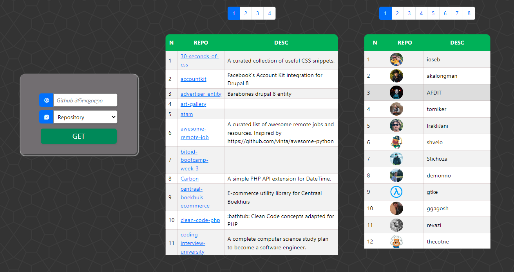
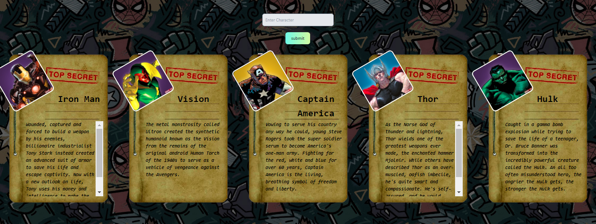

# ✅01 - Simple Form with Image Upload 📷

[Bitoid Technologies](https://www.bitcamp.ge/) challenge for Simple Form with Image Upload, input validations included

## Screenshots


# ✅02 - Github API 💻

[Bitoid Technologies](https://www.bitcamp.ge/) challenge for Github API calling User Followers and Repositories

## Screenshots



# ✅03 - Marvel API ⚔

[Bitoid Technologies](https://www.bitcamp.ge/) challenge for API calling and storing
data in database

## Installation

Create database **'marvel'** (user - "root" / password - ❌)  
Create table **'heroes'** by executing sql script

```bash
CREATE TABLE `heroes` (
  `id` int(4) NOT NULL AUTO_INCREMENT,
  `name` varchar(30) NOT NULL,
  `format` varchar(5) NOT NULL DEFAULT 'empty',
  `comment` varchar(500) NOT NULL,
   PRIMARY KEY (id)
)
```

## Screenshots


